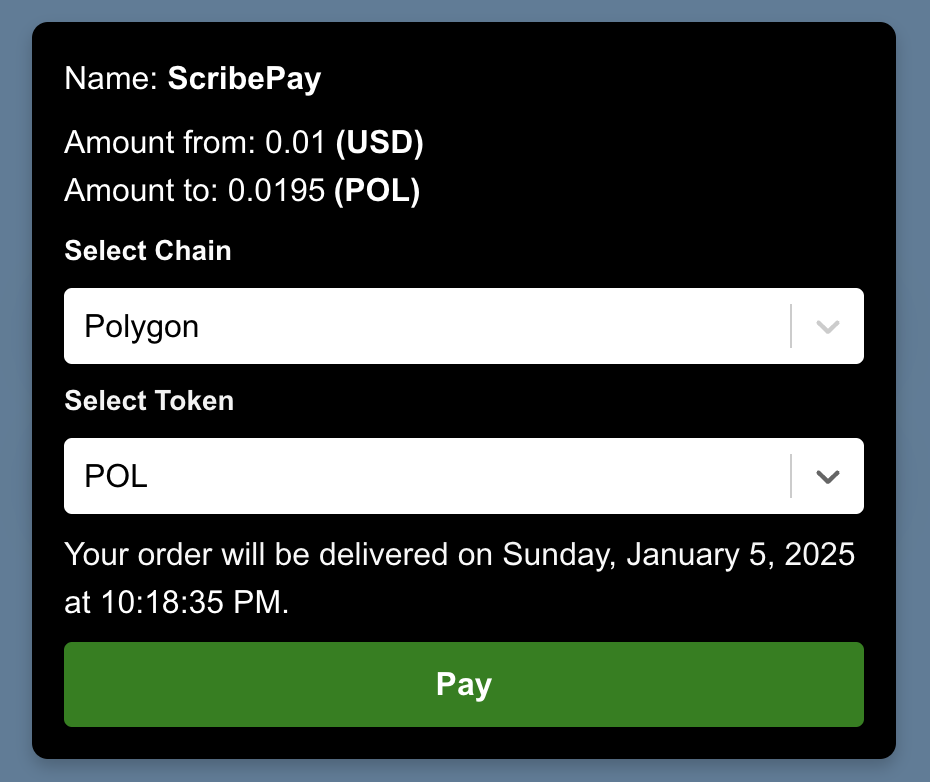

# SDK

<figure><figcaption></figcaption></figure>

## **Installation**

Install the Scribe SDK package using npm:

```
npm install scribe-sdk
```

## Usage

**Step 1: Import the Payment Component**

Import the `Payment` component from the SDK:

```
import { Payment } from "scribe-sdk/src";
```

**Step 2: Initialize the Provider**

Use `ethers.js` to create a provider. Here's an example of setting it up in a React component:

```html
import { useEffect, useState } from "react";
import { ethers } from "ethers";

const App = () => {
  const [provider, setProvider] = useState<ethers.BrowserProvider | undefined>(undefined);

  useEffect(() => {
    const { ethereum } = window;
    if (ethereum) {
      const newProvider = new ethers.BrowserProvider(ethereum);
      setProvider(newProvider);
    }
  }, []);
  
  return <div>Initialize Provider</div>;
};

export default App;

```

**Step 3: Use the Payment Component**

Embed the `Payment` component into your application with the required props:

```html
<Payment
  amount="100" // Specify the amount
  expectedDelivery={1698576000} // Provide expected delivery in Unix timestamp
  providerConfig={{
    apiKey: "your-api-key", // Replace with your API key
    provider: provider, // Pass the initialized provider
  }}
  theme="dark" // Choose between "light" or "dark"
/>

```

## Types

**Payment Props**

Below are the types for the `Payment` component:

```
interface PaymentProps {
  amount: string; // Amount to be paid
  expectedDelivery: number; // Delivery time in Unix timestamp
  providerConfig: ProviderConfig; // Configuration for the provider
  theme: "light" | "dark"; // UI theme
}

```

**Provider Configuration**

Define the provider settings with the following type:

```
export type ProviderConfig = {
  apiKey: string; // API key for authentication
  providerUrlConfig?: ProviderURLConfig; // Optional provider URL configuration
  provider?: JsonRpcProvider | BrowserProvider | WebSocketProvider; // Provider instance
  chainId?: number; // Optional chain ID for specifying networks
};

```

## **Customization**

**Theme**

The `theme` prop allows you to switch between **light** and **dark** modes to match your application's design.

**Example Code**

Here is a complete example:

```
import React, { useEffect, useState } from "react";
import { ethers } from "ethers";
import { Payment } from "scribe-sdk/src";

const PaymentApp = () => {
  const [provider, setProvider] = useState<ethers.BrowserProvider | undefined>(undefined);

  useEffect(() => {
    const { ethereum } = window;
    if (ethereum) {
      const newProvider = new ethers.BrowserProvider(ethereum);
      setProvider(newProvider);
    }
  }, []);

  return (
    <Payment
      amount="150"
      expectedDelivery={1698576000} // Example Unix timestamp
      providerConfig={{
        apiKey: "your-api-key",
        provider: provider,
      }}
      theme="light"
    />
  );
};

export default PaymentApp;

```

### **Troubleshooting**

* **Missing Provider:** Ensure the user's browser supports Ethereum (`window.ethereum`) and that a wallet like MetaMask is installed.
* **Invalid API Key:** Verify that the `apiKey` provided in `providerConfig` is correct.
* **Incorrect Unix Timestamp:** Check the format of the `expectedDelivery` prop to ensure it's a valid Unix timestamp.

### FAQs


1. **What is the `providerConfig` used for?** It configures the SDK to communicate with the blockchain network, including API keys and provider details.
2. **Can I use custom themes?** Currently, only `light` and `dark` themes are supported.
3. **How do I get the `expectedDelivery` timestamp?** Use a timestamp generator or the `Date` object in JavaScript:


```
const timestamp = Math.floor(new Date().getTime() / 1000);
```

This structured documentation ensures clarity and ease of use for developers integrating the **Scribe SDK**.
